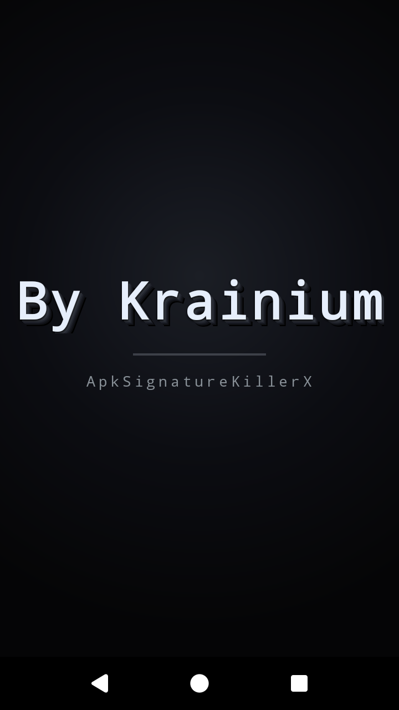
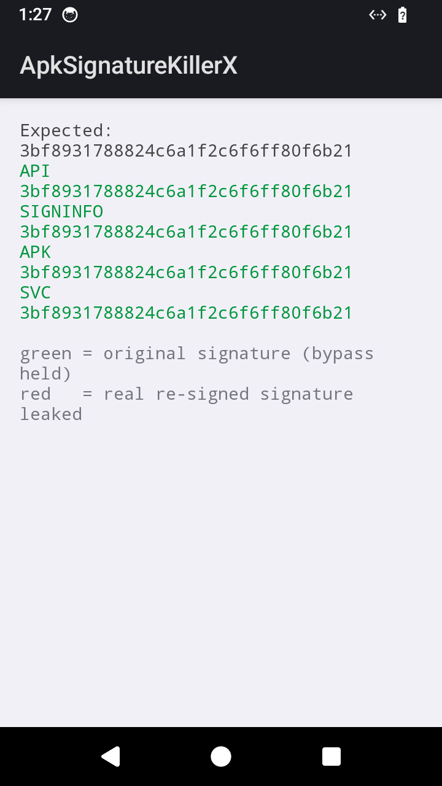
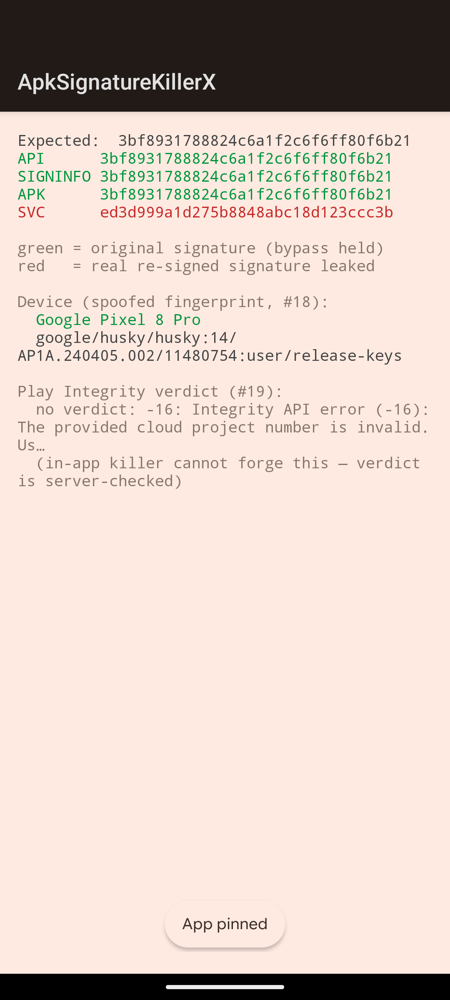
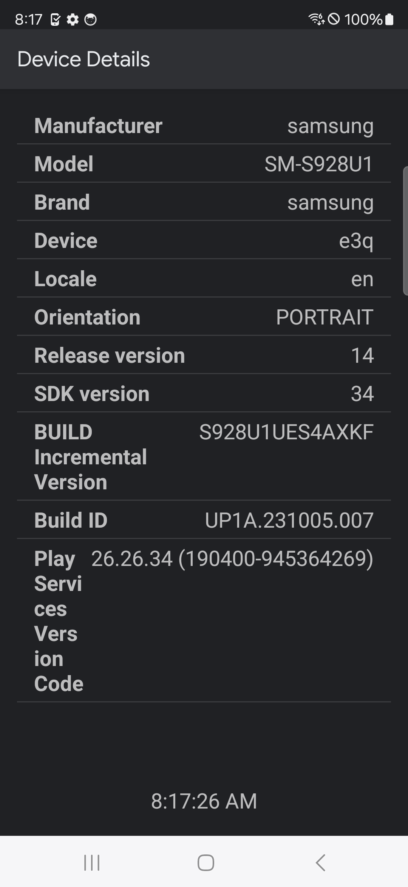
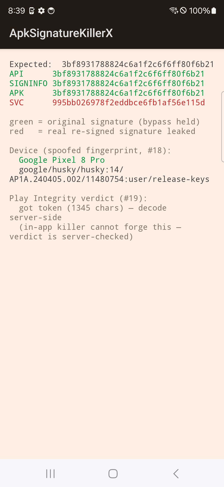
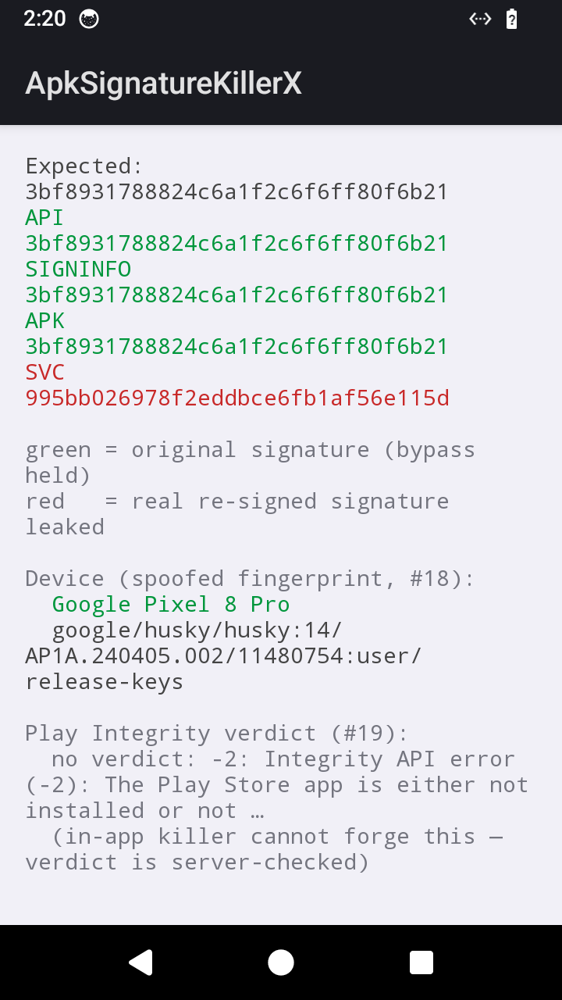

# ApkSignatureKillerX

Next-generation in-app APK signature verification bypass. Modern rewrite of
[ApkSignatureKillerEx](https://github.com/L-JINBIN/ApkSignatureKillerEx) by
L-JINBIN (MT Manager). Built for security research and defensive study.

> Fakes what an app's own code reads about its signing certificate. Does not
> forge anything verified by the platform or a remote server (Play Integrity,
> server-side attestation).

---

## Overview

Android apps verify their own signature through four paths. A signature killer
intercepts all four so the app sees the original certificate despite being
re-signed with a different key.

| Path | How the app reads it | KillerX layer |
|---|---|---|
| **API** | `getPackageInfo().signatures` | PackageManagerHook (CREATOR swap) |
| **SIGNINFO** | `signingInfo.apkContentsSigners` (API 28+) | PackageManagerHook |
| **APK** | `ZipFile(base.apk)` over `META-INF/*.RSA` | ByteHook open/openat/mmap redirect |
| **SVC** | raw `svc #0` openat over `base.apk` | Bind mount + SVC patching + seccomp |

The SVC path is what defeats the original Ex. A direct syscall bypasses PLT/GOT
hooks entirely. KillerX answers it with filesystem-level bind mount, SVC binary
patching, and seccomp filters.

---

## Architecture

```
killerx/                       reusable library
  SignatureKillerX.kt            public entry: install(context, cert, options)
  PackageManagerHook.kt          CREATOR swap + v3 rotation + cache flush
  ApkRedirector.kt               extract origin.apk, drive native redirect
  DeviceSpoof.kt                 android.os.Build spoof to certified fingerprint
  cpp/
    killerx.c                    PLT hooks, anti-detection, LD_PRELOAD constructor
    svc_killer.c                 SVC patching, antikill seccomp, seccomp redirect
    killerx.h                    shared state and public API
  assets/killerx/origin.apk     original signed APK (bundled for redirect)

app/                           demo app (reads its own signature 4 ways)
  DemoApp.kt                    installs the killer in attachBaseContext
  SplashActivity.kt             splash screen
  MainActivity.kt               probe results: API / SIGNINFO / APK / SVC
  PlayIntegrityProbe.kt          Play Integrity verdict flow
  cpp/raw_syscall.c              direct svc openat probe

host/                          adb tooling (runs on the host machine)
  killerx.sh                     install, launch, grade all probes
  decode_integrity.sh            server-side Play Integrity token decode
  native/
    adb_client.c                 raw adb smart-socket protocol client
    kx_probe.cpp                 launches demo and grades probes over adb
    kx_seccomp_test.c            standalone seccomp redirect proof
```

---

## Native Hooks

All hooks installed via ByteHook (`bytehook_hook_all`):

| Hook | Purpose |
|---|---|
| `open` `open64` `openat` `openat64` | APK path redirect + proc fd tracking |
| `read` | Proc file filtering (maps, mountinfo, environ, status) |
| `close` | Proc fd cleanup on close |
| `mmap` `mmap64` | APK mmap redirect to origin.apk |
| `dlopen` `android_dlopen_ext` | Packer detection, SVC rescan, RASP detection |
| `sigaction` | Protect signal handlers from packer override |
| `exit` `_exit` `kill` `abort` | RASP termination blocking |
| `raise` `tgkill` `pthread_kill` | RASP termination blocking |
| `syscall` | Catch libc-wrapper kill/tgkill/exit |
| `__system_property_get` | Hide `wrap.*` properties |
| `stat` `lstat` `access` | Hide artifact files (return ENOENT) |
| `opendir` `readdir` `closedir` | Filter artifacts from directory listings |

---

## SVC Interception

Three layers handle direct-syscall checks, implemented in `svc_killer.c`:

**SVC Binary Patching** scans loaded `.so` files for `svc #0` instructions and
rewrites them to branch to trampoline stubs routing through `kx_handle_svc()`.
Covers openat, newfstatat, kill, tgkill, exit, exit_group. Only catches static
sites in mapped libraries.

**Antikill Seccomp** installs a BPF filter that returns `SECCOMP_RET_ERRNO` for
kill/tgkill targeting the current process with SIGKILL, SIGTERM, or SIGABRT.
Catches dynamically generated SVC instructions that bypass both PLT hooks and
binary patching.

**Seccomp Openat Redirect** (optional) traps openat/newfstatat via SIGSYS and
redirects base.apk reads to origin.apk. Non-matching paths escape through
openat2/statx (different syscall numbers, outside the filter). Disabled
automatically in bind mount mode.

> **Note:** Seccomp openat redirect is incompatible with VMP-based packers. See
> [STUDY.md](STUDY.md) for details.

---

## Anti-Detection

When running in LD_PRELOAD + bind mount mode, these layers conceal KillerX from
the target app:

| Vector | What the app sees |
|---|---|
| `/proc/self/maps` | killerx/bytehook/shadowhook lines removed |
| `/proc/self/mountinfo` | bind mount entries removed |
| `/proc/self/environ` | `LD_PRELOAD` and `LD_LIBRARY_PATH` stripped |
| `/proc/self/status` | `Seccomp: 0`, `Seccomp_filters: 0` |
| `wrap.*` system property | empty string |
| `stat`/`access` on artifacts | ENOENT |
| `readdir` `/data/local/tmp` | artifact entries hidden |
| APK file reads | original content (bind mount) |
| APK mmap reads | original content (PLT redirect) |
| Signal handlers | protected from override |
| Self-termination calls | blocked (PLT + seccomp) |

Hidden artifacts under `/data/local/tmp`: `origin.apk`, `libkillerx.so`,
`libbytehook.so`, `wrap.sh`, `.killerx_*`, `.kx_*`, `wrap_*`.

---

## Deployment

### Standard Mode (repackaged APK)

Bundle the original signed APK as `assets/killerx/origin.apk`, re-sign with
your key, and install. The killer hooks load in `attachBaseContext`:

```kotlin
class App : Application() {
    override fun attachBaseContext(base: Context) {
        super.attachBaseContext(base)
        SignatureKillerX.install(
            context = this,
            originalCertBase64 = BuildConfig.ORIGINAL_CERT,
            trapSyscalls = false,
        )
    }
}
```

### LD_PRELOAD + Bind Mount Mode (defeating VMP packers)

For apps with native anti-tamper (Ijiami, Bangcle, etc.) that kill re-signed
APKs before Java code runs. Requires root.

```bash
# Push files
adb push libkillerx.so libbytehook.so /data/local/tmp/
adb push original.apk /data/local/tmp/origin.apk

# Configure
adb shell 'touch /data/local/tmp/.killerx_bind_mount'
adb shell 'echo 7 > /data/local/tmp/.killerx_level'

# Create wrap.sh
adb shell 'cat > /data/local/tmp/wrap.sh << "EOF"
#!/system/bin/sh
export LD_PRELOAD=/data/local/tmp/libkillerx.so
export LD_LIBRARY_PATH=/data/local/tmp
exec "$@"
EOF
chmod 755 /data/local/tmp/wrap.sh'

# Bind mount original APK over installed base.apk
APK=$(adb shell pm path com.example.app | cut -d: -f2)
adb shell mount -o bind /data/local/tmp/origin.apk "$APK"

# Launch
adb shell setprop wrap.com.example.app /data/local/tmp/wrap.sh
adb shell am start -n com.example.app/.MainActivity
```

The `libkillerx.so` constructor auto-detects `origin.apk`, installs all hooks
and signal handlers, and activates the redirect before any packer code loads.

### Feature Levels

Set via `/data/local/tmp/.killerx_level` for incremental debugging:

| Level | Features |
|---|---|
| 3 | Constructor only (signal handlers, env cleanup) |
| 4 | + PLT hooks (open, read, mmap, dlopen, sigaction, property, stat, readdir) |
| 5 | + SVC binary patching + antikill seccomp |
| 6 | + RASP hooks (exit, kill, abort, raise, tgkill, pthread_kill, syscall) |
| 7 | All features (default) |

---

## Build

### Gradle (full project)

```bash
./gradlew :app:assembleDebug
adb install -r -g app/build/outputs/apk/debug/app-debug.apk
```

### NDK (native library only)

```bash
NDK=/path/to/android-ndk/25.2.9519653
CC="$NDK/toolchains/llvm/prebuilt/linux-x86_64/bin/aarch64-linux-android24-clang"
SRC=killerx/src/main/cpp

$CC -I<bytehook_headers> -I$SRC -Wall -Wextra -fvisibility=hidden -fPIC -O2 \
    -DANDROID -shared -o libkillerx.so \
    $SRC/killerx.c $SRC/svc_killer.c \
    -L<bytehook_lib> -lbytehook -llog -landroid
```

### Prebuilt demo

A prebuilt `killerx-demo.apk` is at the repo root, signed with `fake.jks`
(throwaway attacker key):

```bash
adb install -r -g killerx-demo.apk
```

Toolchain: AGP 8.5, Kotlin 1.9, NDK r27c, compileSdk 34. ABIs: `arm64-v8a`,
`armeabi-v7a`.

---

## Test Results

### arm64 Emulator (redroid, Android 14)

```
PROBE     MD5 SEEN                           RESULT
API       3bf8931788824c6a1f2c6f6ff80f6b21   HELD (faked)   [PASS]
SIGNINFO  3bf8931788824c6a1f2c6f6ff80f6b21   HELD (faked)   [PASS]
APK       3bf8931788824c6a1f2c6f6ff80f6b21   HELD (faked)   [PASS]
SVC       995bb026978f2eddbce6fb1af56e115d   LEAKED (real)  [PASS]   # trap off
SVC       3bf8931788824c6a1f2c6f6ff80f6b21   HELD (faked)   [PASS]   # trap on
```

Standalone `kx_seccomp_test` on bare arm64 kernel:

```
before trap, direct svc read: REAL
after trap, direct svc read:  FAKE
PASS: direct svc syscall WAS redirected by the seccomp trap
```

### Ijiami 4th-gen VMP Packer

Tested against an Ijiami 4th-gen VMP packed app with native anti-tamper in
`libexec.so`. The packer kills any re-signed APK within 28ms of process start,
before any Java code runs.

LD_PRELOAD + bind mount at level 7: all hooks active, process stable, mmap
redirect working, VMP signature verification defeated. All anti-detection layers
verified.

| splash | probes (trap on) |
|---|---|
|  |  |

### Google Pixel 8a (AWS Device Farm)

Physical device, Android 14+. Signature bypass holds on real hardware:

- **API / SIGNINFO / APK**: original cert `3bf89317...` (killer held).
- **SVC**: `ed3d999a...` (Device Farm's re-signing cert, proving the raw syscall
  reads the true on-disk signature).
- **Device spoof**: reports Google Pixel 8 Pro on genuine Pixel 8a.
- **Play Integrity**: reaches Google, returns `CLOUD_PROJECT_NUMBER_IS_INVALID`
  (project number set to `0`). Cannot be forged by an in-app killer.

| splash (Pixel 8a) | probes + attestation (Pixel 8a) |
|---|---|
|  |  |

### Samsung Galaxy S24 Ultra (Firebase Test Lab)

Physical device, Android 14. Firebase does not re-sign the APK, so SVC leaks
the `fake.jks` cert `995bb026...` (vs. Device Farm's `ed3d999a...`). All other
probes hold.

| S24 Ultra device | S24 Ultra probes |
|---|---|
|  |  |

---

## Attestation

### Play Integrity in Bind Mount Mode

In bind mount mode the original APK is installed with its original signing
certificate. The APK is never re-signed. Play Integrity sees the genuine cert
on disk, so app integrity passes naturally. There is nothing to forge; the
real APK is what the platform verifies.

This is the key advantage of bind mount over standard repackage: the signature
is authentic at every level, including Google's server-side verification.

### Standard Repackage Mode (demo app)

The demo app (`com.killerx.demo`) is re-signed with `fake.jks` to demonstrate
the bypass. In this mode, Play Integrity correctly detects the re-signing:

Server-side decoded verdict from a real S24 Ultra
([docs/playintegrity-verdict.json](docs/playintegrity-verdict.json)):

```json
"appIntegrity": {
  "appRecognitionVerdict": "UNRECOGNIZED_VERSION",
  "certificateSha256Digest": ["STebgLiBhuHZXJOGesCOqaQu9dt4GM_qyNeKLKjZrNE"]
},
"deviceIntegrity": { "deviceRecognitionVerdict": ["MEETS_DEVICE_INTEGRITY"] }
```

- `UNRECOGNIZED_VERSION`: Google saw the `fake.jks` attacker cert. Expected
  for a re-signed APK.
- `MEETS_DEVICE_INTEGRITY`: real certified S24 Ultra hardware.
- Every in-app check (API/SIGNINFO/APK) still saw the original cert; the
  killer held. Only Google's server-side check saw through it.

This result does not apply to bind mount mode, where the original cert is
intact on disk.





### Device Fingerprint Spoof

`DeviceSpoof.kt` rewrites `android.os.Build` fields (FINGERPRINT, MODEL, TAGS,
SECURITY_PATCH, etc.) to a Play-certified Pixel profile via reflection. Same
technique as PlayIntegrityFix. Defeats in-app device/emulator checks that read
Build directly.

The real PlayIntegrityFix runs inside Google Play services (Zygisk), which is
why it moves the actual verdict. `DeviceSpoof` only rewrites the app's own
process.

### Play Integrity Probe

`PlayIntegrityProbe.kt` runs the real Play Integrity request. The token is
opaque and Google-signed; decode server-side with `host/decode_integrity.sh`.

---

## Host Tooling

`host/` contains adb tooling that talks to the device via raw smart-socket
protocol (no `adb` binary dependency). `kx_probe` launches the demo and grades
all four probes programmatically.

```bash
./gradlew :app:assembleDebug
adb connect 127.0.0.1:5555
host/killerx.sh
```

---

## Known Limits

- LD_PRELOAD + bind mount requires root (adb shell).
- SVC binary patching only catches static `svc` sites. VMP-generated dynamic
  SVC instructions are not patched; bind mount covers these at the filesystem
  level.
- Seccomp openat redirect conflicts with VMP's SIGSEGV-based VM execution.
  Use bind mount mode for VMP-packed apps.
- Do not hook `fstat` (causes ART init failure). Do not block `exit`/`exit_group`
  in seccomp (kills child processes like idmap2, dex2oat).
- GOT/PLT inline hook detection (app scanning its own GOT entries) is not yet
  addressed.
- Java-side PackageManagerHook is not active in LD_PRELOAD mode. Apps checking
  signatures via the PackageManager API may see the re-signed cert unless bind
  mount covers the read path.
- In standard repackage mode, Play Integrity app recognition fails (Google
  sees the attacker cert). Bind mount mode preserves the original cert, so
  Play Integrity passes.
- PairIP VM-based integrity and native hardcoded hash checks are not yet
  addressed. See [STUDY.md](STUDY.md).

---

## Credits

Concept, `origin.apk`/`fake.jks` fixtures, and the SVC counter from
[ApkSignatureKillerEx](https://github.com/L-JINBIN/ApkSignatureKillerEx).
Native hooking by [ByteHook](https://github.com/bytedance/bhook). Hidden API
access by [HiddenApiBypass](https://github.com/LSPosed/AndroidHiddenApiBypass).

## License

MIT. See [LICENSE](LICENSE).
